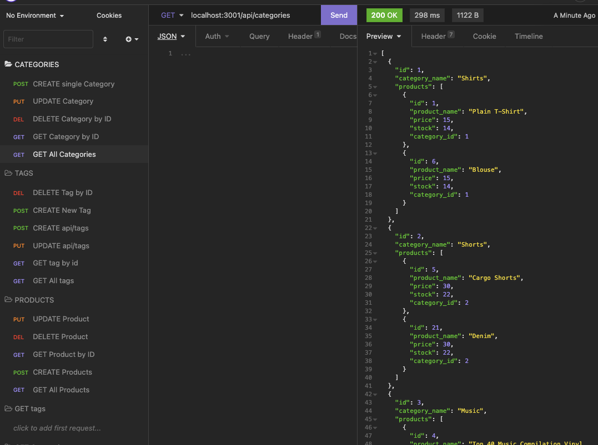
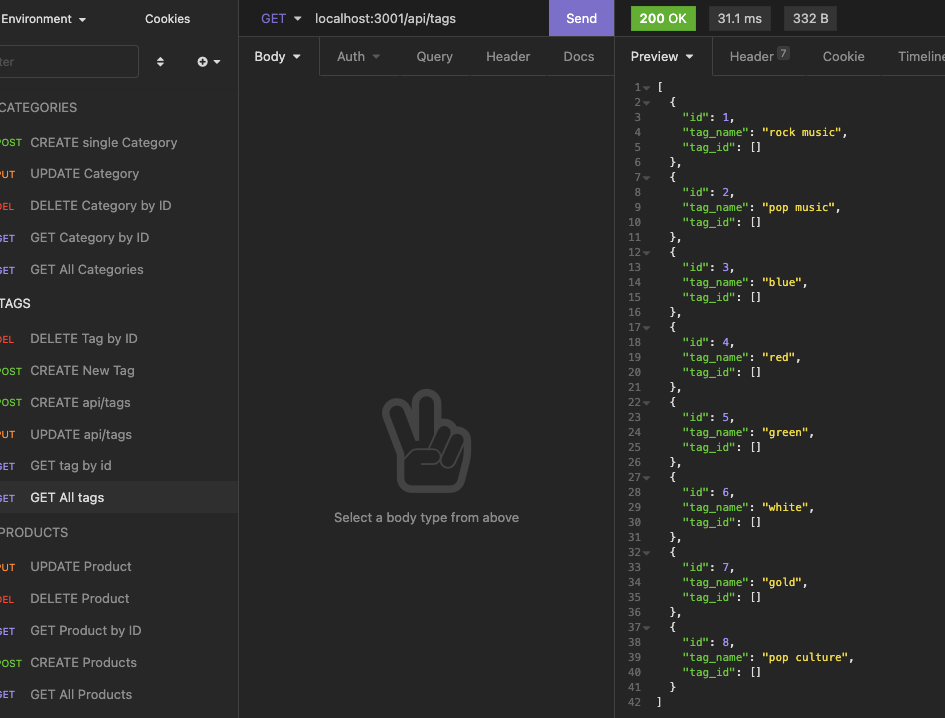
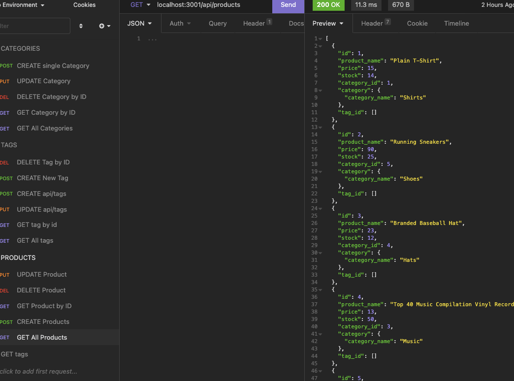

# ORM E-Commerce

## Description

This homework assignment is to build the back-end for an e-commerce site by modifying starter code, configuring `Express.js API` to use `Sequelize` to interact with a `MySQL` database.

API GET Routes tested in Insomnia:



---



---




- __The acceptance criteria for this assignment:__

```md
GIVEN a functional Express.js API
WHEN I add my database name, MySQL username, and MySQL password to an environment variable file
THEN I am able to connect to a database using Sequelize
WHEN I enter schema and seed commands
THEN a development database is created and is seeded with test data
WHEN I enter the command to invoke the application
THEN my server is started and the Sequelize models are synced to the MySQL database
WHEN I open API GET routes in Insomnia for categories, products, or tags
THEN the data for each of these routes is displayed in a formatted JSON
WHEN I test API POST, PUT, and DELETE routes in Insomnia
THEN I am able to successfully create, update, and delete data in my database
```

---

### How to Use

* From the command line, type the following code for database seeding:
  
> npm run seed

* Next from the command line, type the following code to invoke application:
> npm run start

---

### Links to Application Demo video on Youtube

- [MySQL DB Seeding](https://youtu.be/ZPEy-H3l3wk)
- [NPM Start Demo](https://youtu.be/472JPI-MkMU)
- [Insomnia_Route Demo](https://www.youtube.com/watch?v=advYaqqCQFU)

---

### Technology Used:


- HTML/CSS  
- Javascript
- Node.js
- Express.js
- MySQL
- MySQL2
- Sequelize
- Insomnia

---
### Author

[cheribc](https://github.com/cheribc/ORM-E-Commerce)

---

#### License

[MIT](LICENSE)

